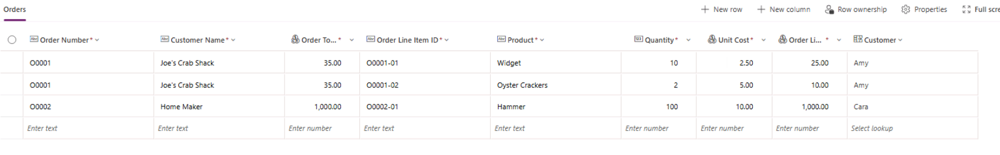

# Demo 01 - Using Copilot to Enhance Dataverse Data Model

- Create a new Dataverse table called Orders with the following column definitions:

  - Order Number - Text
  - Customer Name - Text
  - Order Total - Currency
  - Order Line Item ID - Text
  - Product - Text
  - Quantity - Whole Number
  - Unit Cost - Currency
  - Order Line Item Total - Currency

- Populate with sample data similar to the following:

- Prompt Copilot with the following: `For the current Orders table, please recommend enhancements I could or should make to the data model to align with best practices.`
- Prompt Copilot with the following: `Create a Customers table and then create a one-to-many relationship between the new Customers table and the existing Orders table.`
- Prompt Copilot with the following: `Create an Order Line Items table and then create a one-to-many relationship between the existing Orders table and the new Order Line Items table.`
- Prompt Copilot with the following: `Create a data model for me that I can use to track orders, customers on those orders, and individual order line items (including line item totals and order totals) with proper relationships between the tables.`. For table options, use **Multiple tables** and for relationships, use **Include**.
