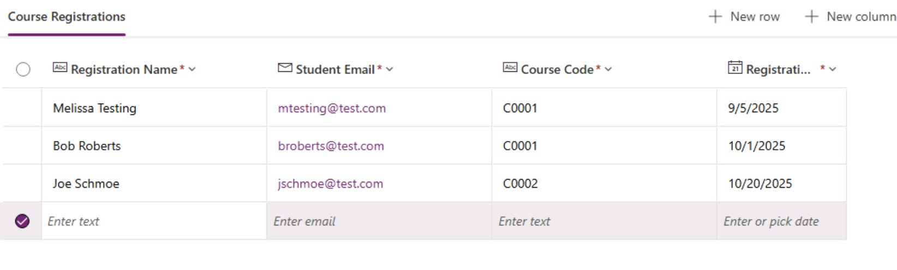

# Lab 01: Plan, create, and automate Power Platform environments with Dataverse

> **You’ll practice**

> 1) Using **Dataverse** as the data platform  
> 2) Applying **environment best practices** (types, security groups, capacity)  
> 3) **Automating** environment creation with **PowerShell**

---

## Prerequisites

- You have the **Power Platform admin** or **Dynamics 365 admin** role in the tenant
- You have enough **Dataverse database capacity** to create a **Sandbox** or a **Trial** environment
- Windows PowerShell 5.1+ (or PowerShell 7+) on your machine.

---

## Section A — Environments: create and secure one properly

**Goal:** Create a new environment with a Dataverse database and restrict access via a security group (best practice).

### A1) Create an Entra security group

1. Go to **<https://entra.microsoft.com>**.
2. Navigate to **Groups ▸ All groups ▸ + New group**.
3. **Group type:** *Security*  
   **Group name:** `PP-DEV-Students`  
4. Click **No members selected** and add a few users (e.g., admin account, `Alex Wilber`, `Nestor Wilke`)
5. Click **Create**
6. Note the group’s **Object ID** (you’ll need it for the PowerShell section - copy/paste to a local Notepad doc).

### Notes

- You **can** assign a security group to most environment types, but **not** to the **Default** or **Developer** environment.
- Assigning a group ensures only intended members get access to the environment’s maker and Dataverse resources.

### A2) Create a new environment with a Dataverse database

1. Open **<https://admin.powerplatform.microsoft.com>** (Power Platform admin center, PPAC).  
2. Click **Manage** and select **Environments** in the left navigation, then **+ New**.
3. Fill the first page:
   - **Name:** `DEV – Training`  
   - **Region:** choose your tenant’s region (e.g., *United States*)  
   - **Type:** **Sandbox** (recommended for dev/test). If you lack capacity, choose **Trial**.  
   - **Purpose:** `Hands-on lab environment`  
   - **Add a Dataverse data store:** **Yes**  
   - (If prompted for billing) Leave **Pay-as-you-go/Azure subscription** **Off** for this lab.
   - Select **Next**.
4. Database settings:
   - **Language** and **Currency** (choose appropriate defaults)  
   - **Security group:** select **PP-DEV-Students** (created above)  
   - **URL** (unique name for the environment - this is where you could set a custom domain)  
   - **Enable Dynamics 365 apps:** **No** for this lab *(This choice is not reversible later)*  
   - **Deploy sample apps and data:** **No**  
   - Select **Save**.
5. Wait for the environment status to become **Ready** (refresh if needed).

**Checkpoint ✅** You have an environment `DEV – Training` with a Dataverse database and a security group assigned.

---

## Section B — Automate environment creation & governance with PowerShell

**Goal:** Script environment creation (with a Dataverse database) and verify your work.

> You’ll use the **Microsoft.PowerApps.Administration.PowerShell** and **Microsoft.PowerApps.PowerShell** modules.

### B1) Install modules and sign in (first time only)

Open **PowerShell** (Run as Administrator is recommended for module install):

```powershell
# Install (first time); harmless to re-run with -Force
Install-Module -Name Microsoft.PowerApps.Administration.PowerShell -Scope CurrentUser -Force
Install-Module -Name Microsoft.PowerApps.PowerShell -Scope CurrentUser -Force

# Sign in (opens a browser prompt)
Add-PowerAppsAccount
```

### B2) Discover valid locations

```powershell
# See available regions/locations for environment creation
Get-AdminPowerAppEnvironmentLocations
```

Pick a value from the Location column (e.g., unitedstates) for the next step.

### B3) Create a Sandbox environment with a Dataverse database

The `-ProvisionDatabase` switch provisions the Dataverse database at creation time.
If you create an environment without a database, you can add one later using `New-AdminPowerAppCdsDatabase`.

```powershell
# --- Customize these variables ---
$displayName     = "DEV – Training (Automated)"
$location        = "unitedstates"     # Use a value from B2
$envSku          = "Trial"            # Alternatives: Production, Trial, Developer, etc.
$language        = (Get-AdminPowerAppCdsDatabaseLanguages -LocationName $location *English*).LanguageName
$currency        = "USD"
$securityGroupId = "<ObjectId of PP-DEV-Students>"  # From Section A1, step 5
# ---------------------------------
# Create environment WITH Dataverse database
$env = New-AdminPowerAppEnvironment `
  -DisplayName $displayName `
  -LocationName $location `
  -EnvironmentSku $envSku `
  -ProvisionDatabase `
  -LanguageName $language `
  -CurrencyName $currency `
  -SecurityGroupId $securityGroupId `
  -WaitUntilFinished $true

$env
```

> Navigate to **Settings ▸ Users + permissions** and **Dataverse ▸ Security roles** to see the difference between environment access (via group) and app/data permissions (via roles/teams).

---

## Section C — Dataverse essentials

**Goal:** Get hands-on with Dataverse tables to see the data platform used inside environments

1. Open your browser to **<https://make.powerapps.com>**.  
2. In the **environment picker** (top-right), select any environment you already have access to (e.g., one of those created in earlier steps)
3. In the left navigation, select **Tables**.
4. Select **+ New table ▸ Create new tables**, click **Start from blank**, and configure:
   - **Display name:** `Course Registrations`  
   - Click **New column ▸ Edit column**
   - Configure:
      - **Display name:** `Registration Name`
      - **Data type:** `Single line of text`
      - **Format:** `Text`
      - **Required:** `On`
   - Add columns (**+ New column**):
      - **Display name:** `Student Email`
         - **Data type:** `Single line of text`
         - **Format:** `Email`
         - **Required:** `On`
      - **Display name:** `Course Code`
         - **Data type:** `Single line of text`
         - **Format:** `Email`
         - **Required:** `On`
      - **Display name:** `Registration Date`
         - **Data type:** `Date and time`
         - **Format:** `Date only`
         - **Required:** `On`
5. Add sample data - Add 2–3 rows (use realistic values). For example:



6. Click **Save and exit**
7. Click **Course Registrations** in the set of available tables to explore the table designer. In the next lab we will drill into some of these options further.

---

## Debrief & Best Practices

- Use separate Dev/Test/Prod environments and keep Default for personal productivity/prototyping.
- Choose the right environment type:
  - Sandbox (dev/test), Production (live), Trial (short-term evals), Developer (per-maker).
- Assign an Entra security group to control who can access the environment (not supported for Default/Developer).
- Do not enable Dynamics 365 apps unless you intend to deploy Dynamics workloads; the choice is not reversible.
- Consider Pay-as-you-go (Azure subscription) for project-scoped environments that want metered billing.

---

## Troubleshooting

- I don’t see the New environment button: Ensure you have Power Platform admin or Dynamics 365 admin role.
- Capacity error when creating Sandbox/Production: Use Trial for the lab or free up database capacity.
- Security group can’t be set: This is expected for Default and Developer environments.
- PowerShell cmdlet not found: Reopen PowerShell after installation or run `Import-Module Microsoft.PowerApps.Administration.PowerShell`.
- Environment stuck provisioning: Refresh PPAC, confirm region choice, and verify service health in Microsoft 365 admin center ▸ Health.
