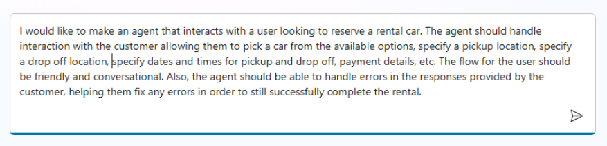

# Lab 04 – Getting Started with Copilot Studio

## Duration

45–60 minutes

## Learning Objectives

- Understand the Copilot Studio interface and architecture.  
- Build and test your first Copilot.  
- Explore core use cases and how copilots fit into the Power Platform.  

---

## Step-by-Step Instructions

### Part A – Explore Copilot Studio (10–15 min)

1. **Sign in** to [Copilot Studio](https://copilotstudio.microsoft.com) with your Microsoft 365 credentials.
2. When prompted with the **Welcome to Microsoft Copilot Studio** dialog, choose **United States** in the country/region dropdown, and click **Start free trial**
3. In the **Environment** picker (upper right), select an appropriate environment (e.g., **Dev One**)  
4. On the **Home page**, review the following:
   - The **left navigation panel** and available options.
   - The **environment selector** in the top-right corner (note how environments connect to Dataverse).  
5. Open the the documentation page (Help → Documentation) and review documentation links of interest. Dismiss the documentation dialog.

### Part B – Create Your First Copilot (20 min)

1. From the **Agents** tab, select **+ New agent**.  
2. Click **Configure** and specify "Training Assistant Copilot" for **Name**; click **Create**
3. After creation, explore the **Copilot canvas** where you’ll build conversations.  
4. Review predefined **Topics**; feel free to modify, save, and test each in the **Test your agent** pane on the right.  
5. Add a new **Topic**:  
   - Name: "Course Info"  
   - Trigger phrases: "Tell me about courses", "What training is available?"  
   - Add a message node: "We offer courses on Copilot Studio, Power Automate, and Dataverse. Which would you like to know more about?"  
   - Test in the **Test Bot** window.  

### Part C - Use Copilot to Create Your Agent - Can you say Fractal!?! (15 - 20 min)

1. Click **Agents** in the left navigation menu and click **+ New agent**
2. Use the **Describe** function to describe an agent for managing car rental reservations - be as descriptive as possible including the functions you'd like to see included (car selection, pick up location, drop off location, dates & times, payment details, etc.).

3. If/when Copilot prompts you for additional clarification, answer the posed questions with as much detail and clarity as you can provide.
4. Review the internal details of each and experiment with modifications.
5. Use the **Test** window to explore the functionality and see the results of any changes you make.

### Part D – Publishing Your Copilot (10–15 min)

1. Try the tutorial at <https://learn.microsoft.com/en-us/microsoft-copilot-studio/fundamentals-get-started>
2. Try the tutorial at <https://learn.microsoft.com/en-us/microsoft-copilot-studio/fundamentals-get-started-teams>
